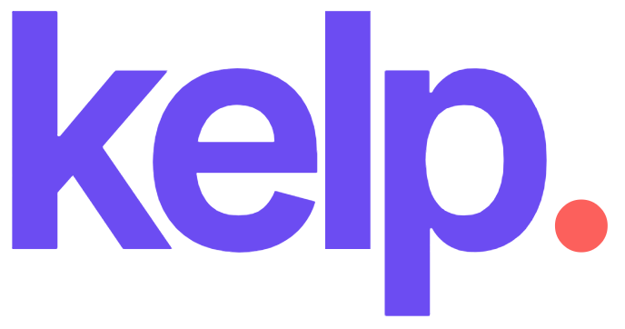

#      

> Compiler from scratch for JavaScript-like language to x86-64 assembly.

Learning how to build a compiler based on the book [Essentials of Compilation](https://github.com/IUCompilerCourse/Essentials-of-Compilation) by Jeremy Siek.

## Table of Contents

...

## License

This software is free to use under the MIT License. See [this reference](https://opensource.org/licenses/MIT) for license text and copyright information.
